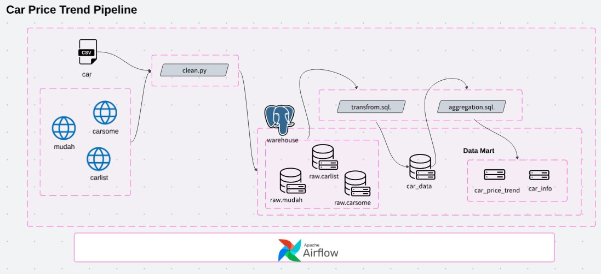
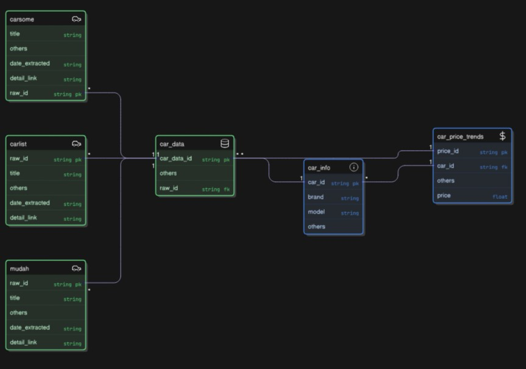

# Car Price Pipeline

This project demonstrates a simple ETL pipeline designed to automate the extraction, processing, and loading of car price data into a warehouse for analysis and comparison. 

**(Disclaimer: Data used for educational purpose)**

**Project aim:**
- Price Trends
- Aftermarket price sell

## Pipeline design 

## Tools
- Webscrape: BeautifulSoup
- Data Lake: S3
- Data Warehouse: PostgreSQL
- Language: Python, SQL
- Orchestration: Airflow
- Container: Docker

## Data Ingestion

#### Source (Extract)
1st stage: Extracting data.

- CSV File
- WebScrape: [Caresoull](https://www.carousell.com.my/categories/cars-32/?searchId=KQYLkR)

#### Data staging (Transformation)

2nd stage: Cleaning, transform, and aggregating.

#### Data Mart (Load)

3rd stage: Load data to mart (aftermarket_price & price_trend)

**Schema**

